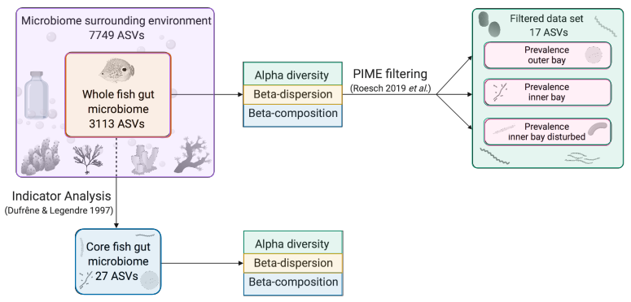

```{r setup, include=FALSE}
knitr::opts_chunk$set(echo = FALSE)
```


This site provides reproducible workflows for the study on the gut microbiome of Caribbean butterflyfish. If you want to follow the workflow step-by-step, please use the navigation bar above or the section below, where scripts are presented in order. If you would instead like to jump to specific analyses, please select an area on the **clickable image map** to go directly to that section.

<div id="image_map">
<map name="workflow">
    <area target="_blank" alt="" title="all fish ASVs" href="wf3.html" coords="82,65,208,168" shape="rect">
    <area target="_blank" alt="" title="all ASVs" href="wf1.html#data-preparation" coords="23,12,261,65" shape="rect">
    <area target="_blank" alt="" title="all ASVs" href="wf1.html#data-preparation" coords="20,168,263,219" shape="rect">
    <area target="_blank" alt="" title="all ASVs" href="wf1.html#data-preparation" coords="23,67,80,167" shape="rect">
    <area target="_blank" alt="" title="all ASVs" href="wf1.html#data-preparation" coords="208,66,264,168" shape="rect">
    <area target="_blank" alt="" title="fish-core" href="wf1.html#run-indicator-analysis-to-identify-core-taxa" coords="94,284,197,363" shape="rect">
    <area target="_blank" alt="" title="alpha diversity all" href="wf4.html#whole-community" coords="300,76,419,105" shape="rect">
    <area target="_blank" alt="" title="beta dispersion all" href="wf6.html#beta-dispersion-plots-whole-v-core" coords="300,106,419,128" shape="rect">
    <area target="_blank" alt="" title="beta diversity all" href="wf5.html#whole-community" coords="300,131,419,156" shape="rect">
    <area target="_blank" alt="" title="alpha diversity core" href="wf4.html#core-community" coords="302,287,421,312" shape="rect">
    <area target="_blank" alt="" title="beta dispersion core" href="wf6.html#beta-dispersion-plots-whole-v-core" coords="301,314,419,337" shape="rect">
    <area target="_blank" alt="" title="beta diversity core" href="wf5.html#core-community" coords="303,339,420,365" shape="rect">
    <area target="_blank" alt="" title="PIME" href="wf7.html" coords="596,53,748,85" shape="rect">
    <area target="_blank" alt="" title="PIME" href="wf7.html" coords="596,99,748,132" shape="rect">
    <area target="_blank" alt="" title="PIME" href="wf7.html" coords="597,147,749,179" shape="rect">
    <area target="_blank" alt="" title="PIME" href="wf7.html" coords="583,11,766,51" shape="rect">
    <area target="_blank" alt="" title="PIME" href="wf7.html" coords="581,177,763,208" shape="rect">
</map>

</div>


## Script Details

[No 1. Indicator Analysis](wf1.html): Script to identify the core fish gut microbiome using Indicator Analysis.

[No 2. Comparing Sample Fractions](wf2.html): Script to assess the relative abundance of phylum & genus level diversity across sample fractions.

[No 3. Subset Fish Only Samples](wf3.html): Script to subset the fish gut only microbiome from the rarefied data for subsequent analyses.

[No 4. Alpha Diversity Estimates](wf4.html): Script testing alpha diversity (Hill Diversity, Shannon Exponential, & Simpson Index) against the whole and core fish gut communities.

[No 5. Beta Diversity Estimates](wf5.html): Script testing different distance metrics to estimate beta diversity using the whole and core fish gut communities across a range of environmental variables.

[No 6. Beta Dispersion](wf6.html): Script to generate faceted boxplot of beta dispersion for all six alpha diversity metrics from the whole & core fish gut microbiomes.

[No 7. PIME Analysis](wf7.html): Script to run Prevalence Interval for Microbiome Evaluation (PIME) to identify core fish gut ASVs.


## Credits {.appendix}

The banner photo, entitled **Butterfly-fish, *Chaetodon capistratus* Linnaeus**, by [David Starr Jordan](https://en.wikipedia.org/wiki/en:David_Starr_Jordan) (1851–1931) was retreived from Wikimedia Commons ([original](https://upload.wikimedia.org/wikipedia/commons/b/b4/FMIB_52079_Butterfly-fish%2C_Chaetodon_capistratus_Linnaeus_Jamaica.jpeg)) and licenced under [CC-0](https://creativecommons.org/share-your-work/public-domain/cc0). The image is part of the [Freshwater and Marine Image Bank](https://content.lib.washington.edu/fishweb/index.html) at the University of Washington. 

## Acknowledgements {.appendix}

We thank Lucia Rodriguez for field assistance, Joan Antaneda for her help in the laboratory, Ross Whippo for conducting the fish survey and Clare Fieseler for taking photos of the benthos. The staff of the Bocas del Toro Research Station provided logistical support. We are grateful to Kristin Saltonstall and Marta Vargas for their support at the Smithsonian Tropical Research Institute’s (STRI) Ecological and Evolutionary Genomics Laboratory. Friederike Clever was supported by a Smithsonian Short Term Fellowship. This project was funded, in part, by a grant from the Gordon and Betty Moore foundation to STRI and UC Davis (PIs: William Wcislo and Jonathan Eisen; http://doi.org/10.37807/GBMF5603) and a PhD studentship by Manchester Metropolitan University to Friederike Clever. A research permit was issued by the Ministerio de Ambiente Panamá (No. SE/A-113-17).

## Author Contributions {.appendix}

FC, ML, and JJS conceived the study. ML, FC, and RFP designed the study with input from AHA. FC, ML, and JJS conducted the fieldwork. ECRG and FC dissected the fish guts. FC extracted the DNA. JS and ML prepared the DNA for sequencing and processed the sequencing data. RFP, AHA, WOM, and ML contributed reagents and supplies. ECRG analysed the photographic benthic quadrats. FC, JS, and ML analysed the data and wrote the first draft of the manuscript with input from RFP and LGEW. All authors reviewed the manuscript and contributed to the final version. JJS and FC created the site.

## Data Availability {.appendix}

Sequencing data has been submitted to the NCBI Short Read Archive (SRA) database (https://www.ncbi.nlm.nih.gov/sra) under project number XXX. 

## Source Code {.appendix}

The source code for this page can be accessed on GitHub by [clicking this link](https://github.com/bocasbiome/web/blob/master/index.Rmd). Source code for the complete site can be accessed [here](https://github.com/bocasbiome/web/) or by clicking  the icon on the far right of the navigation bar.
